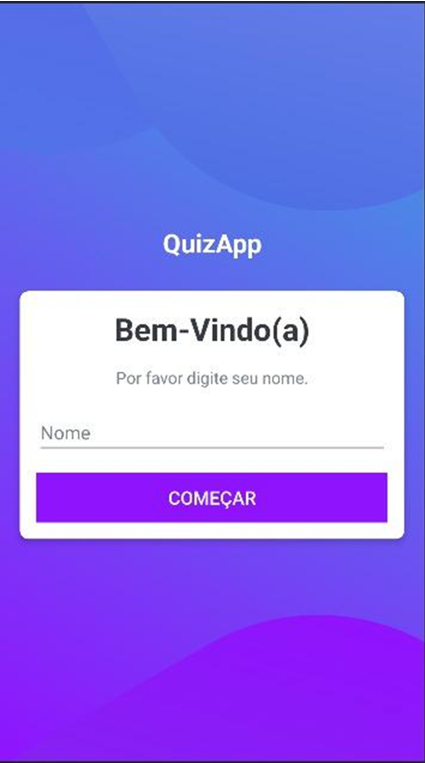
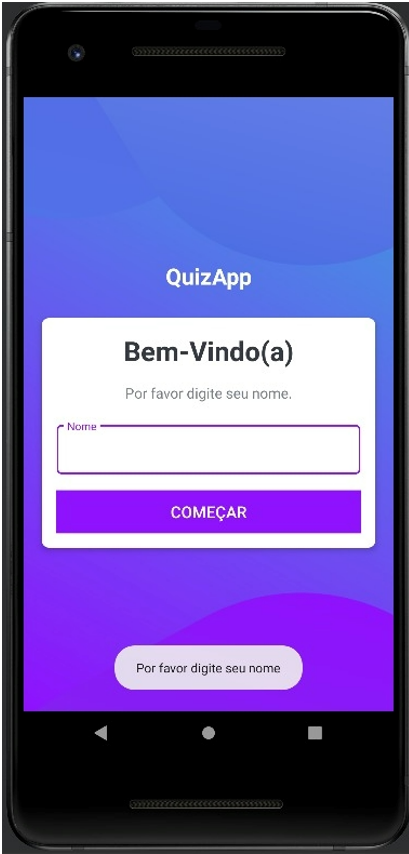
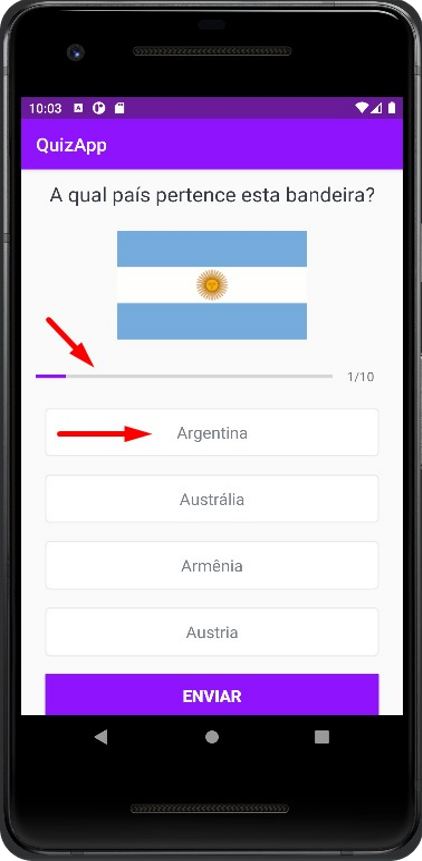
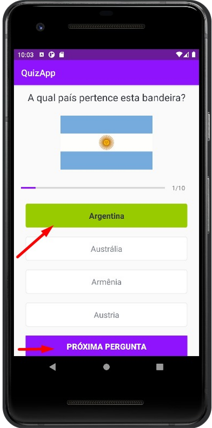
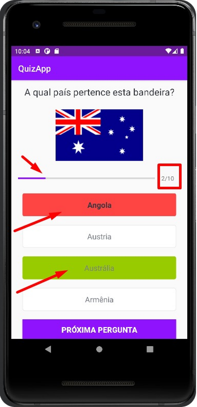

<h1 align="center">
     
    
🚀 QUIZ APP

</h1>

 

 <strong>QUIZ APP</strong> é um aplicado em forma de quiz para o usuário descobrir de qual país pertence cada bandeira no fim mostra o resultado com pontuação e nome do usuário inserido no começo do jogo.
 

<h1>
     
    
🧠 Contexto

</h1>

- Layout 
- Tecnologias Utilizadas
- Integrante da Equipe!

 

 <h1>
     
    
🎨 Layout

</h1>

     
     
     

     
     
     

---

<video width="320" height="240" controls="controls" autoplay="autoplay" src="./imagem/video.mp4" type="video/mp4">
</video>

<h1>
     
    
🛠️ Tecnologias Utilizadas

</h1>

 
 
  
  
  
 

 

<h1>
     
    
👋 Integrantes da Equipe

</h1>

 
- Carlos Alberto - Scrum Master

- Elisabete Alves - dev

- Jéssica - dev

- Paulo Henrique- Product Own 

 

### Feito com 💕 e muita dedicação
